# Dependency graph

The full dependency graph of the Phase0 instruction set — from the /design command through contracts, skills, and agents.

```mermaid
graph TD
    %% ===== ENTRY POINT =====
    DESIGN["/design command"]

    %% ===== CONTRACTS: META =====
    subgraph meta["contracts/meta"]
        contract["contract.md"]
        contract_structure["contract-structure.md"]
        model_structure["model-structure.md"]
    end

    %% ===== CONTRACTS: PRINCIPLES =====
    subgraph principles["contracts/principles"]
        subgraph roles["contracts/principles/roles"]
            facilitator["facilitator.md"]
            onboarding["onboarding.md"]
        end
        modeling_foundation["modeling-foundation.md"]
        durability["durability.md"]
        subgraph best_practices["contracts/principles/best-practices"]
            evaluation["evaluation.md"]
            editorial["editorial.md"]
            facilitation["facilitation.md"]
        end
        subgraph lenses["contracts/principles/lenses"]
            actor_lens["actor.md"]
            usecase_lens["usecase.md"]
            context_lens["context.md"]
        end
    end

    %% ===== CONTRACTS: FORMS =====
    subgraph forms["contracts/forms"]
        f_actor["actor.md"]
        f_catalog["catalog.md"]
        f_context["context.md"]
        f_evaluation["evaluation.md"]
        f_event["event.md"]
        f_glossary["glossary.md"]
        f_invariant["invariant.md"]
        f_note["note.md"]
        f_todo["todo.md"]
        f_usecase["usecase.md"]
    end

    %% ===== SKILLS =====
    subgraph skills_behavioral["skills — behavioral"]
        sk_grounding["grounding-models"]
        sk_discovering["discovering-actors"]
        sk_modeling["modeling-usecases"]
        sk_mapping["mapping-contexts"]
        sk_evaluating["evaluating-artifacts"]
        sk_enforcing["enforcing-style"]
        sk_preserving["preserving-discoveries"]
        sk_navigating["navigating-models"]
    end

    subgraph skills_authoring["skills — authoring"]
        sk_a_actor["authoring-actors"]
        sk_a_catalog["authoring-catalogs"]
        sk_a_context["authoring-contexts"]
        sk_a_eval["authoring-evaluations"]
        sk_a_event["authoring-events"]
        sk_a_glossary["authoring-glossaries"]
        sk_a_invariant["authoring-invariants"]
        sk_a_note["authoring-notes"]
        sk_a_todo["authoring-todos"]
        sk_a_usecase["authoring-usecases"]
    end

    %% ===== AGENTS =====
    subgraph agents["agents"]
        ag_usecases["designing-usecases"]
        ag_coherence["evaluating-coherence"]
        ag_references["evaluating-references"]
        ag_structure["evaluating-structure"]
        ag_style["evaluating-style"]
    end

    %% ===== /design command loads =====
    DESIGN -->|"!cat"| facilitator
    DESIGN -->|"!cat"| facilitation
    DESIGN -.->|"conditional read"| onboarding
    DESIGN -.->|"conditional read"| modeling_foundation

    %% ===== Meta cross-references =====
    contract -.-> contract_structure
    contract_structure -.-> model_structure

    %% ===== Foundation feeds lenses =====
    modeling_foundation -.-> actor_lens
    modeling_foundation -.-> usecase_lens
    modeling_foundation -.-> context_lens

    %% ===== Behavioral skills load principles =====
    sk_grounding -->|"!cat"| modeling_foundation
    sk_discovering -->|"!cat"| actor_lens
    sk_modeling -->|"!cat"| usecase_lens
    sk_mapping -->|"!cat"| context_lens
    sk_evaluating -->|"!cat"| evaluation
    sk_enforcing -->|"!cat"| editorial
    sk_preserving -->|"!cat"| durability
    sk_navigating -->|"!cat"| model_structure

    %% ===== Authoring skills load forms =====
    sk_a_actor -->|"!cat"| f_actor
    sk_a_catalog -->|"!cat"| f_catalog
    sk_a_context -->|"!cat"| f_context
    sk_a_eval -->|"!cat"| f_evaluation
    sk_a_event -->|"!cat"| f_event
    sk_a_glossary -->|"!cat"| f_glossary
    sk_a_invariant -->|"!cat"| f_invariant
    sk_a_note -->|"!cat"| f_note
    sk_a_todo -->|"!cat"| f_todo
    sk_a_usecase -->|"!cat"| f_usecase

    %% ===== designing-usecases agent =====
    ag_usecases --> sk_grounding
    ag_usecases --> sk_modeling
    ag_usecases --> sk_navigating
    ag_usecases --> sk_preserving
    ag_usecases --> sk_enforcing
    ag_usecases --> sk_a_actor
    ag_usecases --> sk_a_catalog
    ag_usecases --> sk_a_usecase
    ag_usecases --> sk_a_event
    ag_usecases --> sk_a_invariant
    ag_usecases --> sk_a_note
    ag_usecases --> sk_a_todo

    %% ===== evaluating-coherence agent =====
    ag_coherence --> sk_evaluating
    ag_coherence --> sk_navigating
    ag_coherence --> sk_grounding
    ag_coherence --> sk_a_eval
    ag_coherence --> sk_a_actor
    ag_coherence --> sk_a_catalog
    ag_coherence --> sk_a_context
    ag_coherence --> sk_a_event
    ag_coherence --> sk_a_glossary
    ag_coherence --> sk_a_invariant
    ag_coherence --> sk_a_note
    ag_coherence --> sk_a_todo
    ag_coherence --> sk_a_usecase

    %% ===== evaluating-references agent =====
    ag_references --> sk_evaluating
    ag_references --> sk_navigating
    ag_references --> sk_grounding
    ag_references --> sk_a_eval
    ag_references --> sk_a_actor
    ag_references --> sk_a_catalog
    ag_references --> sk_a_context
    ag_references --> sk_a_event
    ag_references --> sk_a_glossary
    ag_references --> sk_a_invariant
    ag_references --> sk_a_note
    ag_references --> sk_a_todo
    ag_references --> sk_a_usecase

    %% ===== evaluating-structure agent =====
    ag_structure --> sk_evaluating
    ag_structure --> sk_navigating
    ag_structure --> sk_a_eval
    ag_structure --> sk_a_actor
    ag_structure --> sk_a_catalog
    ag_structure --> sk_a_context
    ag_structure --> sk_a_event
    ag_structure --> sk_a_glossary
    ag_structure --> sk_a_invariant
    ag_structure --> sk_a_note
    ag_structure --> sk_a_todo
    ag_structure --> sk_a_usecase

    %% ===== evaluating-style agent =====
    ag_style --> sk_evaluating
    ag_style --> sk_enforcing
    ag_style --> sk_a_eval
    ag_style --> sk_a_glossary
    ag_style --> sk_a_actor
```

## Layer summary

| Layer | Count | Role |
|---|---|---|
| /design command | 1 | Entry point. Loads facilitator and facilitation contracts via `!cat`, conditionally reads onboarding and modeling-foundation. |
| Contracts — meta | 3 | Self-description: what contracts are, instruction set layout, model output layout. |
| Contracts — principles | 8 | Bind how agents think: facilitator role, three lenses, evaluation stance, editorial voice, durable capture, modeling vocabulary. |
| Contracts — forms | 10 | Bind what agents produce: one form per artifact type. |
| Skills — behavioral | 8 | Each loads one principle contract via `!cat`. Injected into agents to shape reasoning. |
| Skills — authoring | 10 | Each loads one form contract via `!cat` plus reading guidance and creation script. Injected into agents that read or produce artifacts. |
| Agents | 5 | Skill bundles: 1 modeling agent (designing-usecases), 4 evaluation agents. Each agent's skill list determines which contracts get injected. |

## Edge types

- **`!cat`** — Command or skill inlines the contract content when loaded.
- **`-.->`** — Implicit or conditional dependency (prose references, conditional reads, not always loaded).
- **`-->`** — Agent includes the skill in its skill list.
